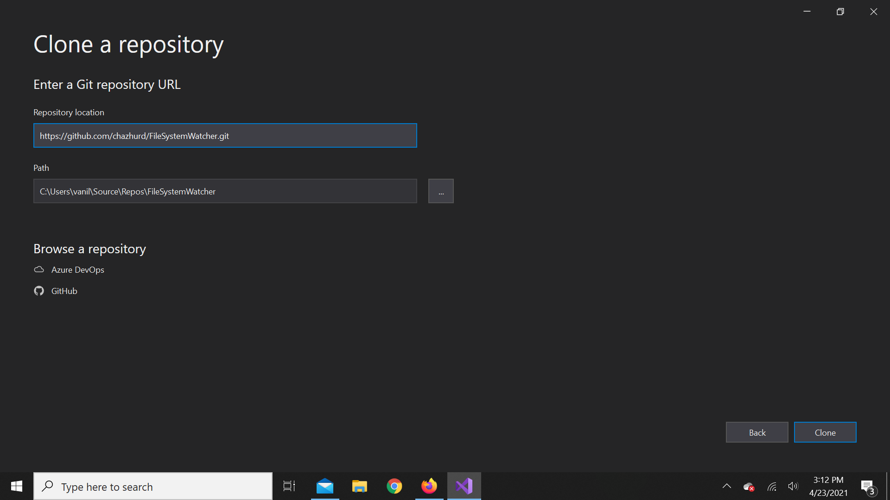
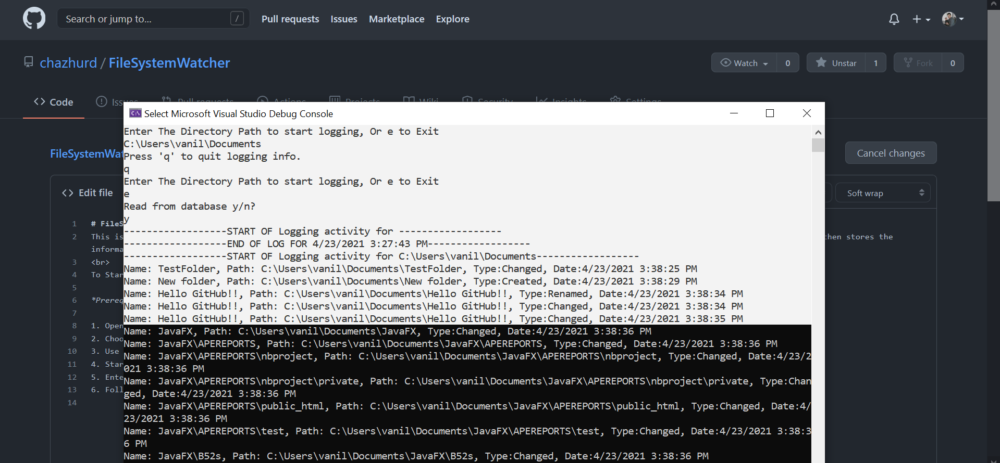

# FileSystemWatcher
This is a simple file system watcher that takes input in the console from the user and watches ANY changes in that directory on all files hidden or not. It then stores the information on changed files in a SQLite database and is able to read the database if chosen by the user. 
 
To Start:

 
*Prereq must have VS2019 or newer

 
1. Open Visual Studio 
2. Choose Clone Repository 
3. Use the Clone Link to clone this project 
4. Start "Assignment 2" (2nd assign in my GUI C# Class) 
5. Enter the path you'd like to watch 
6. Follow instructions from CMD Prompt 

 

